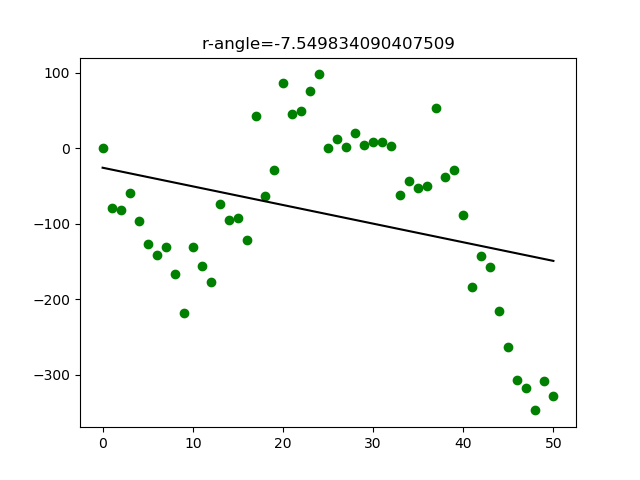
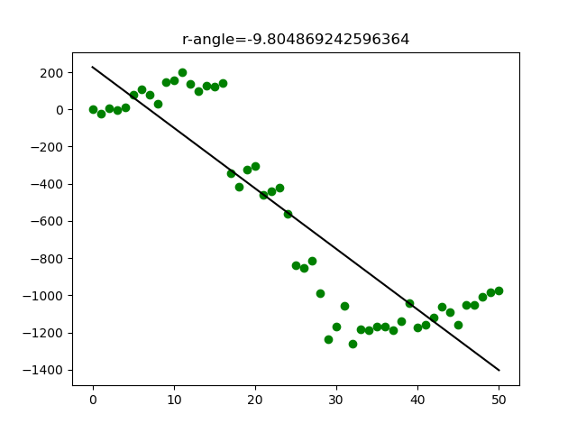
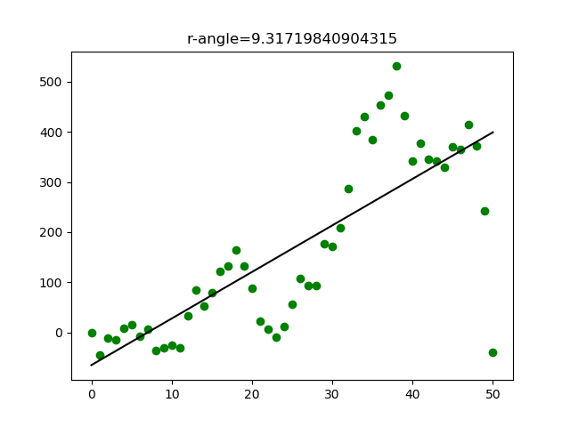
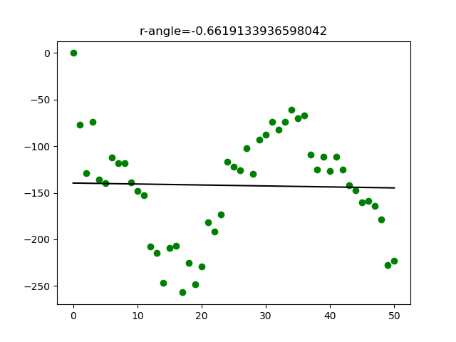
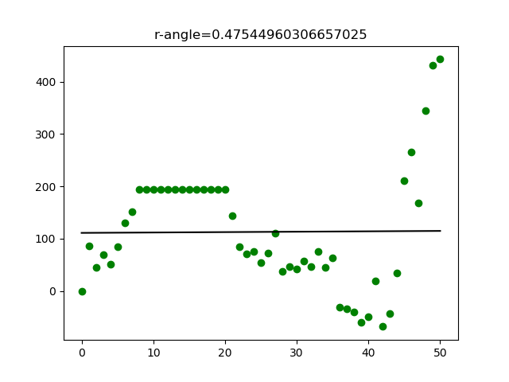

# Int2FP

Intelligent Forex Forecasting Project, An opensource project directed for forecasting Forex using machine learning technologies.

Based on the phrase you always hear whenever you start learning about Forex trading, that says "**History repeats itself**", I decided to start this Forex forecasting project based on machine learning. Why is that? simply, to start solving any problem using machine learning, three simple conditions **must** exist together:

1. You should have data _(a lot of it)_
2. Your problem couldn't be solved using Math _(since math is the best and 100% accurate)_
3. Your data <ins>should have patterns</ins>

So, by returning to the Forex forecasting problem:

1. We have tons of data
2. Forecasting couldn't be solved mathematically
3. Here is our problem, there are thousands of factors that affect the Forex prices, where we couldn't study all of these factors to predict the next value of the trading pairs. We really don't know if Forex data has patterns or not. "**History repeats itself**" means that it has, but this is not proved by anyone yet.

Then, in this project, we will assume that Forex data has patterns.

For now, this project has only LSTM Neural Network application using Keras-Tensorflow (written in Python), so I hope contributors to focus on improving this branch, although all contribution is welcomed. This application is applied on USDJPY pair data history from 5/MAY/2003 to 31/DEC/2018. For more information about the structure of LSTM's used in Keras and how to manipulate their input, please check my git repository [Keras_LSTM_Diagram](https://github.com/MohammadFneish7/Keras_LSTM_Diagram).  

# Requirements

- Python 3.6
- tensorflow
- pandas
- matplotlib
- sklearn
- numpy
- pathlib
- [ta](https://github.com/bukosabino/ta)

# Dataset

Current LSTM is using [USDJPY_Candlestick_15_M_BID_05.05.2003-31.12.2018.csv](./lstm/data/USDJPY_Candlestick_15_M_BID_05.05.2003-31.12.2018.csv), obtained from [Dukascopy](https://www.dukascopy.com/swiss/english/marketwatch/historical/). This dataset represents the M15 period prices history (one record every 15 minutes) of USDJPY pair between 5/MAY/2003 and 31/DEC/2018.

<ins>Data preview:</ins>
```
            Local time        Open        High         Low       Close       Volume
0  05.05.2003 00:00:00  118.940002  119.015999  118.926003  118.950996  3468.199951
1  05.05.2003 00:15:00  118.946999  118.974998  118.932999  118.948997  3108.899902
2  05.05.2003 00:30:00  118.954002  118.974998  118.892998  118.959000  3083.300049
3  05.05.2003 00:45:00  118.966003  118.990997  118.922997  118.975998  2914.600098
4  05.05.2003 01:00:00  118.992996  119.000000  118.967003  118.985001  3088.800049
5  05.05.2003 01:15:00  118.987999  119.001999  118.953003  118.987999  3175.399902
6  05.05.2003 01:30:00  118.987000  119.023003  118.973000  118.984001  3237.600098
7  05.05.2003 01:45:00  118.989998  119.002998  118.973999  118.995003  2998.899902
8  05.05.2003 02:00:00  118.990997  119.039001  118.990997  118.995003  2742.199951
9  05.05.2003 02:15:00  118.999001  119.032997  118.973000  119.008003  3151.699951
```
_Note: you can use any dataset for any Forex pair or time frame, but it must keep the same structure as above._

# Input/Output Options

- <ins>Input Options:</ins>

Current LSTM branch supports controlling the number of input features as well as the shape of these inputs to match both stateful and stateless Keras-LSTM input modes _(for more information about stateful & stateless input options please check: [Keras RNN documentations](https://Keras.io/layers/recurrent/), [Keras_LSTM_Diagram](https://github.com/MohammadFneish7/Keras_LSTM_Diagram))_, this could be done by setting the `stateful` hyperparameter to `True` or `False` respectively in the [lstm_regression.py](./lstm/lstm_regression.py). Besides, you can also control the number of input features to be as one of the following:

1. **5 Features** done by setting `add_taforex_features = False` this will use the basic Forex variables as input. The resulting features are: `['Open', 'High', 'Low', 'Close', 'Volume']`.

2. **64 Features** done by setting `add_taforex_features = True` this will use the basic Forex variables in addition to 59 Forex indicator calculated using the [ta - Forex Technical Analysis Library](https://github.com/bukosabino/ta), all togather will represent the LSTM input. The resulting features are: `['Open', 'High', 'Low', 'Close', 'Volume', 'volume_adi', 'volume_obv', 'volume_obvm', 'volume_cmf', 'volume_fi', 'volume_em', 'volume_vpt', 'volume_nvi', 'volatility_atr', 'volatility_bbh', 'volatility_bbl', 'volatility_bbm', 'volatility_bbhi', 'volatility_bbli', 'volatility_kcc', 'volatility_kch', 'volatility_kcl', 'volatility_kchi', 'volatility_kcli', 'volatility_dch', 'volatility_dcl', 'volatility_dchi', 'volatility_dcli', 'trend_macd', 'trend_macd_signal', 'trend_macd_diff', 'trend_ema_fast', 'trend_ema_slow', 'trend_adx', 'trend_adx_pos', 'trend_adx_neg', 'trend_vortex_ind_pos', 'trend_vortex_ind_neg', 'trend_vortex_diff', 'trend_trix', 'trend_mass_index', 'trend_cci', 'trend_dpo', 'trend_kst', 'trend_kst_sig', 'trend_kst_diff', 'trend_ichimoku_a', 'trend_ichimoku_b', 'trend_visual_ichimoku_a', 'trend_visual_ichimoku_b', 'trend_aroon_up', 'trend_aroon_down', 'trend_aroon_ind', 'momentum_rsi', 'momentum_mfi', 'momentum_tsi', 'momentum_uo', 'momentum_stoch', 'momentum_stoch_signal', 'momentum_wr', 'momentum_ao', 'others_dr', 'others_dlr', 'others_cr']`.

- <ins>Output Options</ins>:

Concerning the output or the labels, we have two basic assumptions here, wherein both we will be solving a single label regression problem. In the first one, we will be trying to forecast the next `Close` price value of the Forex pair under study based on a number of look-back time steps in the input features _(this look-back value is controlled using the `time_steps` hyperparameter)_.

In the second assumption, we will be also looking back for a pre-defined `time_steps` value. However, this time instead of predicting the next `Close` value, we will be predicting a value between `-1` and `+1`, that represents the angle of the regression line that defines a number of future `Close` points, starting from the current `Close` value. This could be controlled by setting the `look_farword` hyperparameter _(default value = 50)_. This value is calculated as:

`aTan(regr.slope) * 180 / PI / 9`

This numerical value will show the power of the up or down trend in the next number of candles _(if there is a trend)_. It was found that a value of greater than `+/-0.8` represents a powerful `up/down` trend respectively as shown in the below figures.



# Running LSTM

You can simply run the model by executing [lstm_regression.py](./lstm/lstm_regression.py) through:
`Python ./lstm/lstm_regression.py`
However, there are a lot of hyper-parameters that you must take care of before that. These parameters are located in the header of 'lstm_regression.py' file so you must edit it manually since it still doesn't yet support passing them as arguments.
These parameters and their default values are:
<pre>
<b>data_path = 'data/USDJPY_Candlestick_15_M_BID_05.05.2003-31.12.2018.csv'</b>   # path of the dataset
<b>checkpoint_weights_h5_path = 'checkpoints/LSTM_00000014_20190429_202523.h5'</b>  # checkpoint file to wich model weights and structure would be save to or loaded from
<b>resume_from_checkpoint = False</b>   # this specifies if it should start a new model or resume from the above checkpoint
<b>checkpoint_autosave_period = 1</b>   # the number of epochs that should be passed everytime before saving the model state 
<b>time_steps = 100</b>   # refere to input options above, actually this is related to Keras specifications of the input shape of the data (check Keras docs for more information)
<b>look_farword = 50</b>  # refere to output options above, it represents the number of future candelsticks which would be used to calculate the trend normalized angle value
<b>num_of_classes = 1</b>   # number of classes or labels, here always equals one
<b>num_of_epochs = 100</b>  # number of training epochs
<b>stateful = True</b>  # specifies how the input is formed fow the network, also refere to the input options above and to the Keras LSTM docs for more information
<b>add_taforex_features = True</b>  # if true you will get 64 input feature as specified in the input options, else you will get 5
<b>debug_future_regression_angle = False</b>  # this switches between next Close value prediction and next trend angle prediction
<b>model_batch_size = 100</b>   # simply the batch size, this is a Keras LSTM related parameter
<b>pip_decimal_place = 3</b>  # this specifies how many decimal places to read from each input feature value
<b>LSTM_output_units = 32</b>   # number of output units for each LSTM layer
<b>num_of_hidden_layers = 0</b>   # this parameter enables stacking LSTM layers togather
<b>drop_out_value = 0.3</b>   # value of the drop-out regulizer
<b>label_type = 0</b>   # if zero = 'next_close_price' else if one = 'future_regression_angle'
<b>number_of_features = -1</b>  # this represents the number of input features currently 5 or 64, this would be automatically detected later at runtime so keep its default value
</pre>

<ins>A typical output after a complete run should look like [this](./lstm/log/ouput_example.txt).</ins>

# Using GPU

This project supports both CPU/GPU processing, although it is not advised to use CPU Since LSTM training is too slow. So To use your GPU:
- Install CUDA for using in tensorflow _(follow this [installation guide](https://www.tensorflow.org/install/gpu))_
- Install tensorflow-gpu _(Note: Current tensorflow-gpu version was making problems for me, I solved that by installing <b>tf-nightly-gpu v 2.0.0-dev20190327</b>)_

# Results

For the current time, results are not so promising, the model is still failing to predict the next `Close` as well as the future trend angle. Maybe the real problem is in the model, and maybe Forex data simply has no obvious pattern to be detected and learned by the model. Contributions are needed, so please do if you have the potential.

# License
This project is licensed under [GNU General Public License v3][https://github.com/MohammadFneish7/Int2FP/blob/master/LICENSE].
